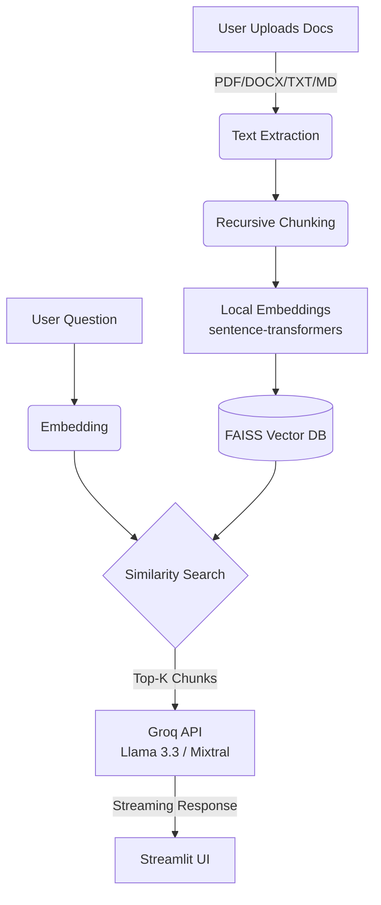

# 🔍 DocQuery AI — Portfolio-Grade RAG Chatbot

<div align="center">


**A high-performance RAG chatbot that lets you chat with your documents (PDF, TXT, DOCX, Markdown).**
**Features streaming responses, multi-model support (Llama 3.3, Mixtral), and a premium glassmorphism UI.**

[Features](#-features) · [Quick Start](#-quick-start) · [Architecture](#-architecture) · [Deploy](#-deploy)

</div>

---

## ✨ Features

- 📄 **Multi-Format Support** — Upload **PDF, DOCX, TXT, and Markdown** files seamlessly
- ⚡ **Streaming Responses** — Real-time, typewriter-style answers powered by Groq's fast inference
- 🧠 **Smart Model Selection** — Switch between **Llama 3.3 70B** (high IQ), **Llama 3.1 8B** (fast), or **Mixtral**
- 🎨 **Premium UI** — Glassmorphism design, smooth animations, and intuitive layout
- 📊 **Knowledge Analytics** — Visual dashboard showing token counts, page stats, and file breakdown
- 📥 **Chat Export** — Download your full conversation history as a formatted Markdown file
- 🔍 **Precise Citations** — Every answer links back to the exact **source document and page number**
- 🔒 **Privacy First** — Documents are processed locally; only text chunks are sent to LLM for inference

---

## 🏗️ Architecture



---

## 🚀 Quick Start

### Prerequisites

- Python 3.10+
- [Groq API Key](https://console.groq.com/keys) (Free)

### Installation

```bash
# 1. Clone the repository
git clone https://github.com/princesingh-ai-dev/DocQuery-AI.git
cd DocQuery-AI

# 2. Create virtual environment
python -m venv venv
venv\Scripts\activate          # Windows
# source venv/bin/activate     # Mac/Linux

# 3. Install dependencies
pip install -r requirements.txt

# 4. Set up API Key (Optional, or enter in UI)
# Create .env file and add: GROQ_API_KEY=gsk_...

# 5. Run the app
streamlit run app.py
```

---

## 🌐 Deploy to HuggingFace Spaces

This project is ready for one-click deployment to HuggingFace Spaces.

1. Create a **New Space** on HuggingFace (Select **Streamlit** SDK).
2. Upload all files from this repository.
3. Add your `GROQ_API_KEY` in the **Space Settings > Repository Secrets**.
4. That's it! Your RAG chatbot is live.

**Docker Deployment:**
A `Dockerfile` is included if you prefer containerized deployment (e.g., RunPod, Railway, AWS).

```bash
docker build -t docquery-ai .
docker run -p 8501:8501 docquery-ai
```

---

## 🛠️ Tech Stack

| Component | Technology | Purpose |
|-----------|-----------|---------|
| **Frontend** | Streamlit | Interactive, responsive Web UI |
| **LLM Inference** | Groq API | Ultra-fast token generation |
| **Models** | Llama 3.3, Mixtral | State-of-the-art open models |
| **Vector DB** | FAISS | High-speed similarity search |
| **Embeddings** | all-MiniLM-L6-v2 | Local, privacy-preserving embeddings |
| **Parsing** | PyMuPDF, python-docx | Robust multi-format text extraction |

---

## 📄 License

MIT License — Built by **Prince Singh**
